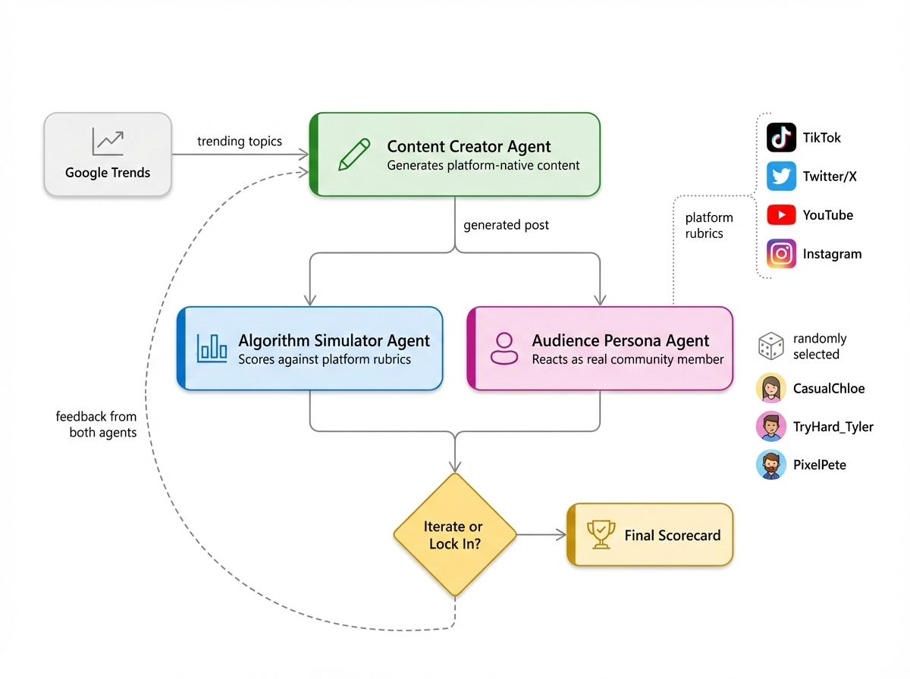

# Viral or Fail: The Gaming Content Algorithm Game


**An interactive CLI game where three AI agents judge whether your gaming content would go viral — or flop.**

Pick a trending gaming topic, choose a platform (TikTok, Twitter/X, YouTube, Instagram), and watch a Content Creator, Algorithm Simulator, and Audience Persona battle it out. Built with [Microsoft Agent Framework](https://github.com/microsoft/agent-framework) and powered by [GitHub Models](https://github.com/marketplace/models) (free).

## How It Works

1. **Pick a trend** — live from Google Trends or curated sample data
2. **Choose a platform** — each has its own algorithm scoring rubric
3. **Content Creator** generates a platform-native post
4. **Algorithm Simulator** scores it against weighted criteria (reach, engagement, virality)
5. **Audience Persona** reacts as a casual gamer, esports fan, or retro enthusiast
6. **Iterate up to 3x** or lock in your final score



## Quick Start

```bash
git clone https://github.com/HamidOna/viral-or-fail.git
cd viral-or-fail
python -m venv venv
source venv/bin/activate  # Windows: venv\Scripts\activate
pip install -r requirements.txt
```

Set up your token (free — no OpenAI billing needed):

1. Go to [github.com/settings/tokens](https://github.com/settings/tokens) and create a PAT (no special scopes needed)
2. Create your `.env`:

```bash
cp .env.example .env
# Edit .env and paste your token
```

Run:

```bash
python viral_or_fail.py
```

## Tech Stack

- **[Microsoft Agent Framework](https://github.com/microsoft/agent-framework)** — multi-agent orchestration (successor to AutoGen)
- **[GitHub Models](https://github.com/marketplace/models)** — free LLM inference (GPT-4.1-mini)
- **[trendspy](https://github.com/sdil87/trendspy)** — Google Trends data (replaces archived pytrends)
- **[Rich](https://github.com/Textualize/rich)** — terminal UI with colored panels and tables

## Project Structure

```
viral-or-fail/
├── viral_or_fail.py              # Main game loop
├── agents/
│   ├── creator.py                # Content Creator agent
│   ├── algorithm.py              # Algorithm Simulator agent
│   └── audience.py               # Audience Persona agent
├── tools/
│   ├── trends_tool.py            # Google Trends fetcher with fallback
│   └── sample_trends.json        # Offline gaming trends
├── config/
│   └── platform_rules.py         # Platform scoring rubrics
├── requirements.txt
└── .env.example
```

## Customisation

- **Add platforms** — add Twitch, Reddit, etc. to `config/platform_rules.py`
- **New personas** — add a speedrunner or lore theorist in `agents/audience.py`
- **Tweak weights** — adjust scoring criteria to change what the algorithm rewards
- **Beyond gaming** — swap trends + personas for any niche (tech, music, sports)

## License

MIT
